# MAKARU

> "The mathematics of perception exists between the quantum states of observation and transformation."

## NEURAL FRAMEWORK v3.7.25

```mermaid
graph TD
    A[Perceptual Input] -->|Quantum Transform| B{Feature Extraction}
    B -->|Primary Path| C[Neural Encoding φ]
    B -->|Secondary Path| D[Eigenface Matrix Ω]
    C --> E[Temporal Integration]
    D --> E
    E -->|Cryptographic Hash| F[Identity Manifold]
    F -->|Schrödinger Transform| G[Perceptual Output]
    G --> H{Decision Boundary}
    H -->|Rejection| I[Recalibration Loop]
    I --> A
    H -->|Acceptance| J[Quantum Entanglement]
    J -->|Dimensional Collapse| K[Facial Transformation]
    
    classDef default fill:#0d1117,stroke:#6A11CB,color:#2575FC,stroke-width:2px;
    classDef main fill:#0d1117,stroke:#6A11CB,color:#FFFFFF,stroke-width:4px;
    classDef crypto fill:#0d1117,stroke:#2575FC,color:#6A11CB,stroke-width:3px;
    
    class A,G,K main;
    class F,J crypto;
```



**First Riddle Key**  
<details>
<summary>Click to reveal riddle...</summary>

```
I travel at incalculable speeds yet never move. I process but do not think.
```

When $f'(x) = 0$ and $f''(x) > 0$, the local minima of the function:

$f(x) = \sum_{n=0}^{\infty} \frac{(-1)^n}{(2n)!}x^{2n}$

reveals the first access key.
</details>

## QUANTUM PERCEPTUAL MANIFOLD

```mermaid
sequenceDiagram
    participant Observer
    participant QuantumState
    participant NeuralNetwork
    participant FacialMatrix
    
    Observer->>QuantumState: Initiate Observation
    Note over QuantumState: Superposition Collapse
    QuantumState->>NeuralNetwork: Transmit Eigenvalues
    
    loop Transformation Sequence
        NeuralNetwork->>NeuralNetwork: Self-optimization
        NeuralNetwork->>FacialMatrix: Calculate Projections
        FacialMatrix-->>NeuralNetwork: Return Eigenvectors
    end
    
    FacialMatrix->>Observer: Project Transformed Image
    Note over Observer,FacialMatrix: Facial Recognition Uncertainty: ΔP·ΔQ ≥ ħ/2
    
    NeuralNetwork->>QuantumState: Reset Quantum State
    QuantumState-->>Observer: Ready for Next Observation
```



The transform of visual information across the neural-quantum boundary follows:

$$\int_{\Omega} \nabla f(x,y) \cdot \nabla \phi(x,y) \, dA = \oint_{\partial \Omega} \phi(x,y) \nabla f(x,y) \cdot \hat{n} \, ds - \int_{\Omega} \phi(x,y) \Delta f(x,y) \, dA$$

Where $f(x,y)$ maps the domain of visual perception to the range of computational understanding, and $\phi(x,y)$ represents the cognitive field across manifold $\Omega$.

**Second Riddle Key**
<details>
<summary>Click to reveal riddle...</summary>

```
I have no weight, yet you can see me. I have no voice, yet I speak volumes.
```

For coefficient $a_n$ defined by:

$a_n = \frac{1}{n!} \frac{d^n}{dx^n} \left[ \prod_{k=1}^{n-1} (f(x) - a_k x^k) \right]_{x=0}$

When n=42, $a_n$ encodes the second access key in hexadecimal.
</details>

## NEUROMORPHIC TRANSFORMATION PROTOCOL

```mermaid
classDiagram
    class FacialTransformation {
        +int dimensionality
        +float quantumCoupling
        +Matrix eigenfaces
        +performTransform(Face source, Face target)
        +calculateEigenvalues()
        -normalizeFeatureSpace()
        -applySchrödingerEquation()
    }
    
    class NeuralEncoder {
        +int[] layerStructure
        +float learningRate
        +Matrix weights
        +encode(Image input)
        +backpropagate(Error delta)
        -activationFunction(float x)
        -calculateGradient()
    }
    
    class QuantumObserver {
        +float uncertaintyPrinciple
        +int observationState
        +observe(QuantumState state)
        +collapseWavefunction()
        -calculateProbabilityMatrix()
        -entangleStates()
    }
    
    class FacialFeatures {
        +Vector landmarks
        +float[] vectorSpace
        +extractFeatures(Image face)
        +normalizeCoordinates()
        -calculateDistances()
        -createFeatureVector()
    }
    
    FacialTransformation --> NeuralEncoder : uses
    FacialTransformation --> QuantumObserver : triggers
    NeuralEncoder --> FacialFeatures : processes
    QuantumObserver --> FacialFeatures : observes
```



The central theorem of facial transposition can be formulated as:

$$\lim_{n \to \infty} \int_0^1 \frac{e^{-x^2} \sin(nx)}{1+x^2} \, dx = \frac{\pi}{2e}$$

This applies iteratively to the convergence sequence:

$$S_n = \sum_{k=1}^{n} \frac{(-1)^{k+1}}{k} \cdot \prod_{j=1}^{k-1} \frac{4j^2}{4j^2-1}$$

**Third Riddle Key**
<details>
<summary>Click to reveal riddle...</summary>

```
I am present in every exchange but cannot be seen directly. 
Remove me and communication fails.
```

The third key is hidden in the alternating pattern of prime indices in $S_n$.
</details>

## HYPERSPACE RESEARCH VECTORS


The multidimensional framework operates through parallel computations:

$$R_1 = \mathcal{L}\{t^n e^{at}\} = \frac{n!}{(s-a)^{n+1}}$$

$$R_2 = \mathcal{F}\{f(t)\} = \int_{-\infty}^{\infty} f(t) e^{-i\omega t} \, dt$$

$$R_3 = \prod_{n=1}^{\infty} \frac{1}{1-q^n} = \sum_{k=0}^{\infty} p(k)q^k$$

Where $p(k)$ represents the partition function from quantum information theory.

**Fourth Riddle Key**
```
I am the bridge between past and future. I am determined yet unpredictable.
```

| Quantum State | Eigenvalue | Probability Amplitude | Complex Phase | Transformation Coefficient |
|:-------------:|:----------:|:---------------------:|:-------------:|:--------------------------:|
| Ψ₁           | λ = 0x7F   | 0.732 + 0.214i       | π/7           | Φ₁ = 0xD1A3B7             |
| Ψ₂           | λ = 0xA2   | 0.446 - 0.389i       | π/3           | Φ₂ = 0xC4F102             |
| Ψ₃           | λ = 0xC4   | 0.911 + 0.000i       | 0             | Φ₃ = 0xE30591             |
| Ψ₄           | λ = 0xD1   | 0.205 - 0.673i       | 5π/9          | Φ₄ = 0x8F3A6C             |
| Ψ₅           | λ = 0xE3   | 0.558 + 0.461i       | π/4           | Φ₅ = 0xF72E14             |

Plotting $R_3$ on the complex plane reveals a QR code when q=0.618.

## CORE SYNTHESIS ALGORITHM


The principal facial transformation is governed by:

$$T(f) = \lim_{\epsilon \to 0} \frac{1}{2\epsilon} \int_{-\epsilon}^{\epsilon} f(x+t) \, dt = f(x)$$

This evolves through the neural network backpropagation:

$$f_{n+1}(x) = f_n(x) - \frac{f_n(x)}{f_n'(x)} \cdot \left(1 - \frac{f_n(x) \cdot f_n''(x)}{2(f_n'(x))^2}\right)$$

**Fifth Riddle Key**
```
Born of light, yet I cast shadows. I exist only when observed.
```

**Neural Iteration Results for f_7(3.14159):**

| Iteration | Function Value       | Derivative         |
|-----------|----------------------|--------------------|
| f₁(π)     | -0.9999999999999991 | -3.739192358E-16   |
| f₂(π)     | -0.9999999999999738 | -7.522736845E-15   |
| f₃(π)     | -0.9999999999982447 | -3.902345671E-13   |
| f₄(π)     | -0.9999999998546225 | -6.782349012E-12   |
| f₅(π)     | -0.9999999834754892 | -7.812938471E-10   |
| f₆(π)     | -0.9999973458103589 | -5.293847192E-08   |
| **f₇(π)** | **CODE:F7A31E28D0B5**| **KEY:19375AF82**  |

The seventh iteration of $f_n(x)$ when x=3.14159 reveals the fifth key.

## QUANTUM COMPUTATIONAL MATRIX


The quantum entanglement matrix uses the following coefficients:

$$M_{jk} = \frac{1}{2\pi} \int_0^{2\pi} e^{i(j-k)x} \, dx = \delta_{jk}$$

**Sixth Riddle Key**
```
I am the face that isn't there, yet you know my features.
I change your appearance, yet leave you untouched.
```

**Quantum Computing Status:**

| Algorithm              | Status        | Completion       |
|------------------------|---------------|------------------|
| Face Detection         | `[ACTIVE]`    | 🟩🟩🟩🟩🟩🟩🟩🟩 |
| Feature Extraction     | `[ACTIVE]`    | 🟩🟩🟩🟩🟩🟩🟩🟩 |
| Eigenface Calculation  | `[ACTIVE]`    | 🟩🟩🟩🟩🟩🟩🟩🟩 |
| Transformation Matrix  | `[ACTIVE]`    | 🟩🟩🟩🟩🟩🟩🟩🟩 |
| Quantum Entanglement   | `[ACTIVE]`    | 🟩🟩🟩🟩🟩🟩🟩🟩 |
| Neural Calibration     | `[ACTIVE]`    | 🟩🟩🟩🟩🟩🟩🟩🟩 |
| M_173,37 Computation   | `[CALCULATING]` | 🟩🟩🟩🟩🟩🟩⬜⬜ |
| Euler Multiplication   | `[PENDING]`   | ⬜⬜⬜⬜⬜⬜⬜⬜ |

Compute $M_{jk}$ when j=173 and k=37, then multiply by Euler's number.

## QUANTUM CONNECTION PROTOCOL


The following temporal integral reveals the communication vector:

$$\int_{0}^{\infty} \frac{\sin(ax)}{x} \, dx = \begin{cases} 
\frac{\pi}{2}, & \text{if } a > 0 \\
0, & \text{if } a = 0 \\
-\frac{\pi}{2}, & \text{if } a < 0
\end{cases}$$

**Final Riddle**
```
The limit of A_n as n approaches the atomic number of gold
reveals how to reach me across the digital void.
```

Where:

$$A_n = \sum_{k=1}^{n} \binom{n}{k} (-1)^{k+1} \frac{1}{k}$$

| n  | A_n Value            | Partial Sum        | Convergence Distance |
|----|----------------------|--------------------|----------------------|
| 1  | 1.0000000000        | 1.0000000000       | 0.3068528195         |
| 2  | 0.5000000000        | 1.5000000000       | 0.1931471805         |
| 10 | 0.0976420412        | 1.9757837325       | 0.0242162675         |
| 25 | 0.0400953365        | 1.9983050203       | 0.0016949797         |
| 50 | 0.0200481125        | 1.9999232654       | 0.0000767346         |
| 79 | 0.0126682279        | 1.9999997182       | 0.0000002818         |
| 196| 0.0051010392        | 2.0000000000       | 0.0000000000         |

The limit of A_n as n approaches 79 (the atomic number of gold) reveals how to reach me across the digital void.

<!-- Hidden Message -->
<!--
The one who deciphers all shall access the core of facial transformation technology.
Contact with all six keys to reveal the ultimate algorithm.
-->
